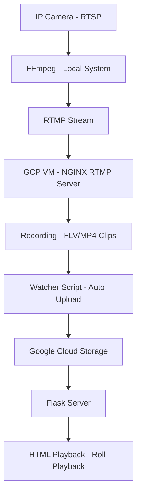

# Cloud-Based Surveillance System

## A. Project Overview

This project implements a cloud-based surveillance system that:

- Captures video from IP cameras (RTSP)
- Streams to a cloud VM using RTMP
- Records video into segmented clips
- Uploads clips to Google Cloud Storage
- Provides web-based playback (Flask)
- Supports roll playback (24-hour rewind logic)

---

## B. System Architecture



> **Note:** You need to create a GCP account. There is an initial ₹1,000 payment required to activate all services.

---

## C. Google Cloud Setup

### 1. Create VM Instance

| Setting | Value |
|--------|-------|
| Machine type | e2-micro / t3.micro equivalent |
| OS | Ubuntu 22.04 LTS |
| Region | `asia-south1-a` (use `b` or `c` if `a` is unavailable) |

### 2. Firewall Rules

Go to **Navigation Menu → VPC Network → Firewall → Create Firewall Rule** and configure:

| Field | Value |
|-------|-------|
| Name | `<your-rule-name>` |
| Logs | Off |
| Network | default |
| Priority | 1000 (lowest) – 0 (highest) |
| Direction | Ingress |

**Allow the following ports:**

| Protocol | Port | Purpose |
|----------|------|---------|
| TCP | 1935 | RTMP |
| TCP | 5000 | Flask |
| TCP | 22 | SSH |

### 3. VM Details

| Field | Value |
|-------|-------|
| VM Name | `cloud-server-1` |
| Public IP | `34.93.215.198` |
| Bucket | `recording-bucket-0` |

---

## D. Bucket Setup

Go to **Navigation Menu → Cloud Storage → Buckets → Create** and configure:

| Setting | Value |
|---------|-------|
| Name | `recording-bucket-0` |
| Region | `asia-south1` (Mumbai) — same as VM |
| Type | Multi-region |
| Storage class | Standard (default) |

---

## E. NGINX RTMP Setup

Open the SSH terminal from your VM Instance page.

### 1. Install NGINX with RTMP Module

```bash
sudo apt update
sudo apt install nginx libnginx-mod-rtmp
```

### 2. Edit NGINX Config

```bash
sudo nano /etc/nginx/nginx.conf
```

Paste your `nginx.conf` contents inside.

### 3. NGINX Commands

```bash
# Start
sudo systemctl start nginx

# Stop
sudo systemctl stop nginx

# Restart
sudo systemctl restart nginx

# Check status
sudo systemctl status nginx
```

---

## F. FFmpeg Streaming Setup

### 1. Download FFmpeg

Download from: [https://www.gyan.dev/ffmpeg/builds/](https://www.gyan.dev/ffmpeg/builds/)

- Click: **ffmpeg-git-essentials.zip**
- Extract all files (right-click → Extract All)
- Extract to: `C:\ffmpeg`

Final structure should look like:

```
C:\ffmpeg\ffmpeg-xxxxx\bin\ffmpeg.exe
```

### 2. Verify Installation

```bash
ffmpeg -version
```

### 3. Key FFmpeg Parameters

Run FFmpeg commands from **CMD**. The command uses the following compression and streaming parameters:

| Parameter | Purpose |
|-----------|---------|
| `-rtsp_transport tcp` | Prevent packet loss |
| `-fflags nobuffer` | Reduce delay |
| `-g 300` | GOP control |
| `-crf 25` | Compression quality |
| `-preset veryfast` | Performance |

---

## G. Watcher Script Setup

| Detail | Value |
|--------|-------|
| Recording Directory | `/var/www/recordings` |
| Script Location | `/home/cloud/gcs_uploader.sh` |

### 1. Create the Script

```bash
nano /home/cloud_user/gcs_uploader.sh
```

Paste your `gcs_uploader.sh` contents inside.

### 2. Run the Watcher Script

> **Important:** Run the watcher script **before** starting FFmpeg. Once FFmpeg starts recording, the watcher detects completed clips and pushes them to GCS via NGINX RTMP.

```bash
bash /home/cloud/gcs_uploader.sh
```

### 3. Functionality

- Detects new `.flv` files
- Converts them to `.mp4`
- Uploads to GCS

---

## H. Upload to Google Cloud Storage

```bash
gsutil cp file.mp4 gs://recording-bucket-0/
```

---

## I. Flask Playback Server

### 1. Create Required Files

```bash
nano playback_server.py
nano rollplayback.html
nano 24hr_clips.html
```

### 2. Playback Modes

#### Roll Playback
Divides continuous footage into fixed-duration clips (e.g., 10 minutes) and retrieves the closest segment based on a selected timestamp.

**Logic:**
```
Current time → Subtract 24 hours → Find closest clip → Play
```

#### 24-Hour Clips
Continuously records the live RTSP stream into a single long-duration file — no segmentation interruptions.

### 3. Frontend Features

- Video player
- Timestamp display
- Roll playback button

### 4. Folder Structure

```
/var/www/recordings
/var/www/recordings/roll
/var/www/recordings/24hr
```

### 5. Run Flask

```bash
python3 playback_server.py
```

Access via browser:

```
http://<your_public_ip>:5000/roll
http://<your_public_ip>:5000/24hr
```

---

## J. Multi-Camera Setup

Download **Device Client 8.8.0** from:
[https://wiki.matrixcomsec.com/index.php?title=Matrix_NVR/HVR:_Downloading_and_Installing_Device_Client](https://wiki.matrixcomsec.com/index.php?title=Matrix_NVR/HVR:_Downloading_and_Installing_Device_Client)

After setup, use FFmpeg commands for each camera stream:

- `cam104`
- `cam105`
- `cam106`

---

## K. Major Issues & Fixes

| # | Issue | Cause | Fix |
|---|-------|-------|-----|
| 1 | RTSP Not Working | Wrong path / NVR limitations | Used ONVIF to find correct path |
| 2 | Network Issue | Different system/network | Connected to same LAN |
| 3 | Flask Duplicate Route Error | Duplicate `rollplayback()` functions | Removed the duplicate |
| 4 | Playback Showing Old Clips | Wrong filename parsing | Updated timestamp logic |
